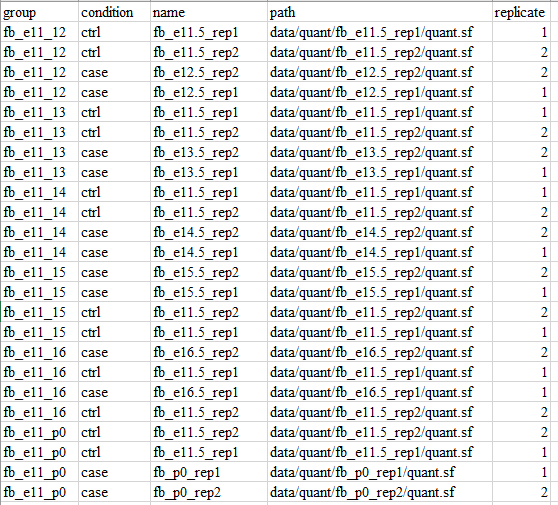
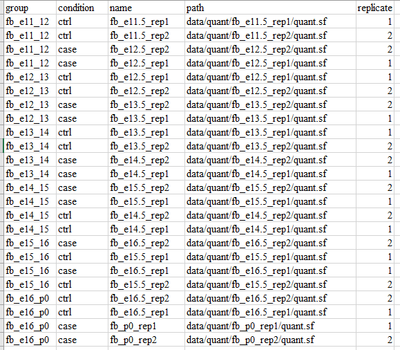

# Preparation

## 转录本定量

**astk** 的输入为转录本的TPM定量文件。转录本的TPM定量文件可以通过salmon获取. 参考[教程](https://combine-lab.github.io/alevin-tutorial/2019/selective-alignment/)

示例代码：

```bash
$ salmon index -t gentrome.fa.gz -d decoys.txt -p 12 -i salmon_index --gencode
$ salmon quant -i salmon_index --gcBias --useVBOpt --seqBias  -r ENCFF329ACL.fastq.gz --validateMappings -o fb_e11.5_rep1 -p 30
$ ls fb_e11.5_rep1
aux_info  cmd_info.json  lib_format_counts.json  libParams  logs  quant.sf
```

> 注： 对于来自GENCODE的数据 --gencode 必须加上

假设我们已经定量好了以下数据：

```bash
$ ll  data/quant | cut -d " " -f 5-
146 Oct 30  2021 fb_e11.5_rep1
146 Oct 30  2021 fb_e11.5_rep2
146 Oct 30  2021 fb_e12.5_rep1
146 Oct 30  2021 fb_e12.5_rep2
146 Oct 30  2021 fb_e13.5_rep1
146 Oct 30  2021 fb_e13.5_rep2
146 Oct 30  2021 fb_e14.5_rep1
146 Oct 30  2021 fb_e14.5_rep2
146 Oct 30  2021 fb_e15.5_rep1
146 Oct 30  2021 fb_e15.5_rep2
146 Oct 30  2021 fb_e16.5_rep1
146 Oct 30  2021 fb_e16.5_rep2
146 Oct 30  2021 fb_p0_rep1
146 Oct 30  2021 fb_p0_rep2
```

## meta

**meta** 是一个用于为差异可变剪切分析生成对照组和处理组的对照信息表格的一个子命令。

**meta** 参数设置如下：

* -o:  输出文件地址
* -repN: 各组的重复样本数目
* -c1: condition 1(ctrl) 样本转录本定量文件路径
* -c2: condition 2(case) 样本转录本定量文件路径
* -gn: 对照组名设置

### 例1

如果我们要生成以fb_e11.5 为控制组， 其他阶段数据为处理组，进行差异可变剪切分析，可以这样运行命令：

```bash
$ mkdir metadata -p
$ astk meta -o metadata/fb_e11_based -repN 2 \
    -c1 data/quant/fb_e11.5_rep*/quant.sf \
    -c2 data/quant/fb_e1[2-6].5_rep*/quant.sf  data/quant/fb_p0_rep*/quant.sf \
    -gn fb_e11_12 fb_e11_13 fb_e11_14 fb_e11_15 fb_e11_16 fb_e11_p0

```

输出为一个CSV文件和JSON文件，CSV文件便于查看， JSON文件用于后续分析。



### 例2

如果我们要生成以相邻阶段分别为控制组和处理组，进行差异可变剪切分析，可以这样运行命令：

```bash
$ mkdir metadata -p
$ astk meta -o metadata/fb_adj_based -repN 2 \
    -c1 data/quant/fb_e1[1-6].5_rep*/quant.sf \
    -c2 data/quant/fb_e1[2-6].5_rep*/quant.sf  data/quant/fb_p0_rep*/quant.sf \
    -gn fb_e11_12 fb_e12_13 fb_e13_14 fb_e14_15 fb_e15_16 fb_e16_p0

```


