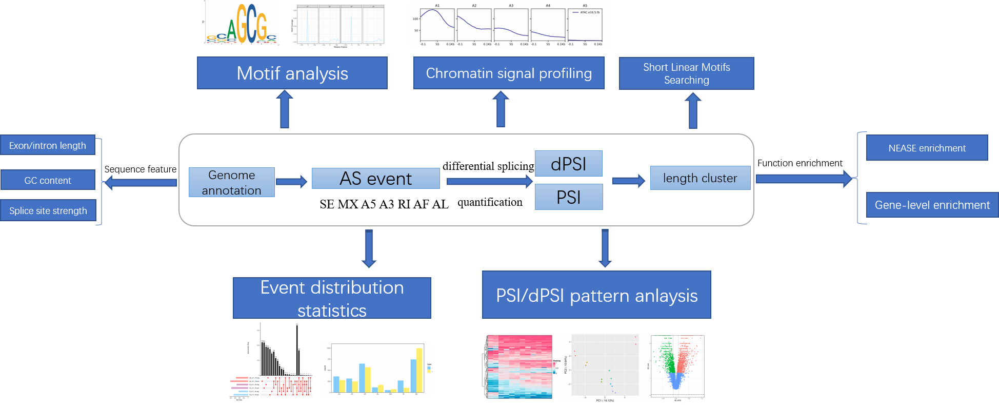

# 介绍

可变剪切(Alternative splicing, AS) 普遍存在于生物体内， 是控制着基因组部分区域能否表达的一个重要机制，是蛋白组多样性产生的重要原因。高通量测序技术的发展促进可变剪切的广泛研究。然而，当前AS分析软件通常只关注于一两个层面，缺乏一个AS分析的全面而灵活的分析流程。在如今每天都产生和积累大量数据的组学时代，这不利于AS机制的综合性分析。因此，我们开发**ASTK**，希望能促进AS事件的功能表征，提高我们对剪接调控的理解。

**ASTK**是一个综合性可变剪切分析工具包，整合了当前流行和强大的软件， 用于对可变剪切多个层面进行个性化分析。当前可进行以下分析：

* 剪切位点强度、exon/intron GC含量长度等序列特征
* 不同条件/类型AS事件分布分析，exon长度聚类
* AS事件PSI/dPSI分析
* 差异AS事件分析
* AS事件基因功能富集分析
* 剪切因子motif分析
* 剪切位点表观信号分析

