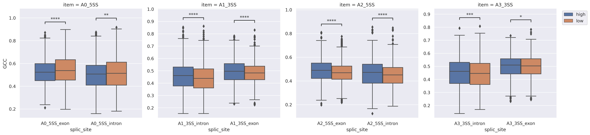

# 特征比较

## 剪切位点强度比较

对两个条件下的剪切位点强度进行统计性比较。该功能可用**vcmp**实现。
其参数设置如下：

- -e: AS 事件剪切位点强度文件， 由**sss**生成
- -o：输出路径
- -test： 统计检验方法，可选[Mann-Whitney|t-test_ind|t-test_welch|Wilcoxon]，默认Mann-Whitney
- -gn： 组名 默认为 g1 g2
- -ft: 图形展示类型 [point|strip|box|boxen|violin|bar]，默认box
- -ff: 输出图片格式 [auto|png|pdf|tiff|jpeg]
- --xtitle：x轴标题
- --ytitle: y轴标题

示例

```bash
$ mkdir vcmp
$ astk vcmp -e sss/fb_e16_SE_*/splice_scores.csv \
    -gn high low -o vcmp/fb_e16_AF_sss.png  \
    --xtitle "splice_site" --ytitle "score" >  vcmp/fb_e16_AF_sss.txt
$ cat vcmp/fb_e16_AF_sss.txt   
p-value annotation legend:
      ns: p <= 1.00e+00
       *: 1.00e-02 < p <= 5.00e-02
      **: 1.00e-03 < p <= 1.00e-02
     ***: 1.00e-04 < p <= 1.00e-03
    ****: p <= 1.00e-04

A1_5SS_high vs. A1_5SS_low: Mann-Whitney-Wilcoxon test two-sided, P_val:1.243e-17 U_stat=6.122e+06
A0_pse_3SS_high vs. A0_pse_3SS_low: Mann-Whitney-Wilcoxon test two-sided, P_val:9.558e-01 U_stat=5.453e+06
A2_pse_3SS_high vs. A2_pse_3SS_low: Mann-Whitney-Wilcoxon test two-sided, P_val:3.981e-01 U_stat=5.515e+06
A3_5SS_high vs. A3_5SS_low: Mann-Whitney-Wilcoxon test two-sided, P_val:2.394e-26 U_stat=4.611e+06
A4_3SS_high vs. A4_3SS_low: Mann-Whitney-Wilcoxon test two-sided, P_val:4.759e-01 U_stat=5.392e+06
```

输出图片


## exon/intron 长度比较

对两个条件下的exon/intron 长度进行统计性比较。该功能可用**vcmp**实现

- -e: AS 事件剪切位点强度文件， 由**elen**生成
- -o：输出路径
- -test： 统计检验方法，可选[Mann-Whitney|t-test_ind|t-test_welch|Wilcoxon]，默认Mann-Whitney
- -gn： 组名 默认为 g1 g2
- -ft: 图形展示类型 [point|strip|box|boxen|violin|bar]，默认box
- -ff: 输出图片格式 [auto|png|pdf|tiff|jpeg]
- -facet: 分面展示
- -log：数据进行log2转换
- --xtitle：x轴标题
- --ytitle: y轴标题
- --xlabel: x轴 label

示例：

```bash
astk vcmp -e Length/0hr_FT_se_*/element_len.csv \
        -gn high low -o vcmp/FT_se_lencmp.png -ft box \
        -log --xlabel ups_intron exon dws_intron \
        --xtitle "element" --ytitle "log2(length)" >  vcmp/FT_se_len.txt
```


## GC 含量比较

对两个条件下的GC 含量进行统计性比较。该功能可用**vcmp**实现

- -e: AS 事件剪切位点强度文件， 由**gcc**生成，不支持滑动窗口设置
- -o：输出路径
- -test： 统计检验方法，可选[Mann-Whitney|t-test_ind|t-test_welch|Wilcoxon]，默认Mann-Whitney
- -gn： 组名 默认为 g1 g2
- -ft: 图形展示类型 [point|strip|box|boxen|violin|bar]，默认box
- -ff: 输出图片格式 [auto|png|pdf|tiff|jpeg]
- -facet: 分面展示
- -log：数据进行log2转换
- --xtitle：x轴标题
- --ytitle: y轴标题
- --xlabel: x轴 label

示例：

```bash
astk vcmp -e gcc/fb_p0_SE_*_b0/gcc.csv --facet \
        -gn high low -o vcmp/gcc/p0_se_gcccmp.png -ft box \
         --xtitle "splic_site" --ytitle "GCC" 
```


